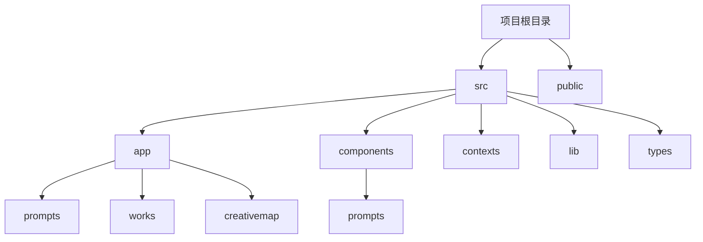

# ZGXZ项目

这是一个使用Next.js构建的Web应用程序，采用吉卜力风格的UI设计。

## 技术栈

- Next.js 14.2.5
- React 18
- TypeScript
- TailwindCSS
- Zustand (状态管理)
- TipTap (富文本编辑器)

## 项目特色

- 吉卜力风格的UI设计，温馨自然、充满童趣
- 提示词管理系统，支持多种类型的提示词创建和编辑
- 响应式布局，适配各种设备屏幕

## 项目结构



## 界面设计

项目遵循吉卜力风格设计指南，主要特点包括：

- 柔和的自然色调：主色调为柔和的绿色(#5a9d6b)，背景为淡雅的米色(#f7f2ea)
- 纸张质感：卡片和元素采用纸张纹理，配合网格背景增强手工感
- 圆角设计：大量使用圆角元素，避免尖锐边缘
- 装饰元素：胶带、翻页效果等创意元素增添趣味性
- 手写感文字：标题使用"马善政"字体，强调手工感和艺术性

## 提示词编辑窗口

提示词编辑窗口采用吉卜力风格设计，主要功能：

- 支持创建、编辑、删除、复制提示词
- 分类管理不同类型的提示词
- 可添加示例辅助理解和使用
- 详细视图显示提示词的全部信息
- 支持表单验证和错误提示

## 安装与运行

```bash
# 安装依赖
npm install

# 开发环境运行
npm run dev

# 构建生产版本
npm run build

# 运行生产版本
npm run start
```

## 许可证

MIT 